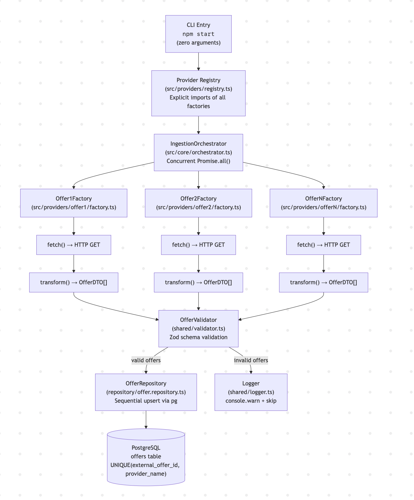

# Almedia Offer Ingestion Job

A one-time CLI job that extracts offers from multiple external offer networks, validates them, and stores them in PostgreSQL.

## Tech Stack

| Category | Technology |
|----------|------------|
| Runtime | Node.js 20+ |
| Language | TypeScript (strict mode) |
| Database | PostgreSQL 15 + pg (node-postgres) |
| Validation | Zod |
| HTTP | Axios (30s timeout, 2 retries, exponential backoff) |
| Containerization | Docker + Docker Compose |
| Testing | Jest |

## Quick Start

### Using Shell Script (Recommended)

```bash
# Build and run everything
./run.sh
```

### Other Commands

```bash
./stop.sh       # Tear down containers and volumes
./check_db.sh   # Query offers table via psql
npm test        # Run unit tests
```

## Architecture

**Factory Pattern + Explicit Registry** — Each provider is a self-contained module implementing `IOfferProvider`. The orchestrator processes providers sequentially.

```
Provider API → fetch() → raw JSON → transform() → OfferDTO[] → validate() → upsert() → PostgreSQL
                                                                    ↓ (invalid)
                                                              console.warn → skip
```

### Architecture Diagram


## Project Structure

```
src/
├── main.ts                    # Zero-arg CLI entry point
├── config/
│   ├── db.ts                  # pg Pool connection
│   └── init-db.sql            # CREATE TABLE schema
├── core/
│   ├── IOfferProvider.ts      # Provider interface
│   └── orchestrator.ts        # Main orchestration logic
├── providers/
│   ├── offer1/                # Provider module
│   │   ├── factory.ts         # Implements IOfferProvider
│   │   ├── types.ts           # Raw API response types
│   │   └── config.ts          # Environment variables
│   ├── offer2/
│   └── registry.ts            # Central provider registry
├── repository/
│   └── offer.repository.ts    # pg upsert operations
├── shared/
│   ├── http-client.ts         # Axios wrapper with retry
│   ├── logger.ts              # Structured JSON logging
│   ├── slug.ts                # Slug generation
│   └── validator.ts           # Zod validation
└── types/
    └── type.definition.ts     # OfferDTO, IngestionSummary
```

## Adding a New Provider

1. Create folder `src/providers/[providerName]/`
2. Add `factory.ts` implementing `IOfferProvider`
3. Add `types.ts` with raw API response types
4. Add `config.ts` for environment variables (if needed)
5. Register in `src/providers/registry.ts`:
   ```typescript
   import { ProviderNameFactory } from './providerName/factory';
   export const providers: IOfferProvider[] = [
     // ...existing providers
     new ProviderNameFactory(),
   ];
   ```

## Future Improvements

| Area | Improvement | Benefit |
|------|-------------|---------|
| **Batch Writes** | Transactional batch inserts instead of sequential upserts | Reduced database round-trips |
| **Retry Queue** | Dead-letter queue for failed offers | Retry failed offers without 
| **Scheduling** | Cron-based scheduling (node-cron or external scheduler) | Automated periodic ingestion |
| **Caching** | Redis cache for duplicate detection | Skip unchanged offers |
